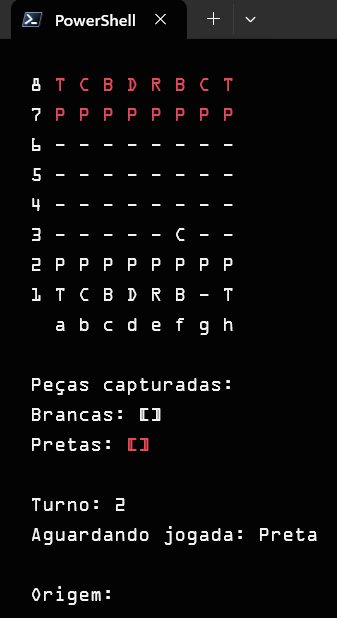

# Jogo de Xadrez em Console com .NET e C#

Um projeto de jogo de xadrez para ser jogado no console, desenvolvido com C# e a plataforma .NET.

## Sobre o Projeto

Este é um projeto que implementa um jogo de xadrez funcional no terminal. O objetivo é permitir que dois jogadores locais disputem uma partida completa, seguindo as regras do xadrez.

## Exemplo de Jogo

<p align="center">
  
</p>

## Arquitetura

O sistema foi projetado em três camadas distintas para garantir organização, manutenibilidade e separação de responsabilidades:

1.  **Camada de Apresentação (Console)**
  *   Responsável pela interação com o usuário e pela renderização do tabuleiro e das informações do jogo no console.

2.  **Camada de Lógica do Jogo (Negócio)**
  *   Contém todas as regras do xadrez, como movimentação de peças, validações de jogadas, xeque, xeque-mate e o controle do fluxo da partida.

3.  **Camada do Tabuleiro**
  *   Abstrai a representação do tabuleiro, das peças e suas posições.

## Funcionalidades

- **Renderização do Tabuleiro:** Exibição do tabuleiro e das peças diretamente no console, com destaque para os movimentos possíveis.
- **Movimentação de Peças:** Implementação da lógica de movimento para todas as peças do xadrez (Rei, Rainha, Torre, Bispo, Cavalo e Peão).
- **Validação de Jogadas:** O sistema valida cada jogada, permitindo apenas movimentos que seguem as regras do jogo.
- **Captura de Peças:** As peças podem capturar peças adversárias, que são removidas do tabuleiro e exibidas em uma lista de peças capturadas.
- **Jogadas Especiais:**
  - **Roque:** Implementação do roque pequeno e do roque grande, um movimento especial que envolve o Rei e uma das Torres.
    - **En Passant:** Suporte para a captura especial *en passant*, exclusiva dos peões.
    - **Promoção:** Um peão que alcança a oitava fileira é promovido a uma peça de maior valor Rainha(Dama).
- **Controle de Turnos:** O jogo alterna automaticamente entre o jogador das peças brancas e o das peças pretas.
- **Detecção de Xeque e Xeque-mate:** O sistema identifica situações de xeque e declara o fim do jogo em caso de xeque-mate, indicando o vencedor.

## Como Começar

Para compilar e executar este projeto em sua máquina local, siga os passos abaixo.

### Pré-requisitos

- [.NET SDK](https://dotnet.microsoft.com/download) instalado.

### Passos

1.  **Clone o repositório para sua máquina local:**
  ```sh
  git clone https://github.com/ericssendelima/xadrez-console.git
  ```

2.  **Navegue até o diretório do projeto:**
  ```sh
  cd xadrez-console
  ```

3.  **Compile e execute a aplicação:**
  ```sh
  dotnet run
  ```

4.  O jogo será iniciado no seu terminal. Siga as instruções na tela para inserir as coordenadas (origem e destino) e realizar suas jogadas.

## Como Jogar

O jogo utiliza o sistema de coordenadas de xadrez padrão (letras de 'a' a 'h' para colunas e números de '1' a '8' para linhas).

1.  **Escolha a Peça:** Quando for a sua vez, digite a posição da peça que deseja mover (ex: `e2`).
2.  **Visualize os Movimentos:** O tabuleiro será redesenhado, destacando os movimentos possíveis para a peça selecionada.
3.  **Escolha o Destino:** Digite a posição para onde deseja mover a peça (ex: `e4`).
4.  **Próximo Turno:** Se o movimento for válido, a peça será movida, e o turno passará para o próximo jogador.

---

*Este README será atualizado à medida que o projeto evoluir.*